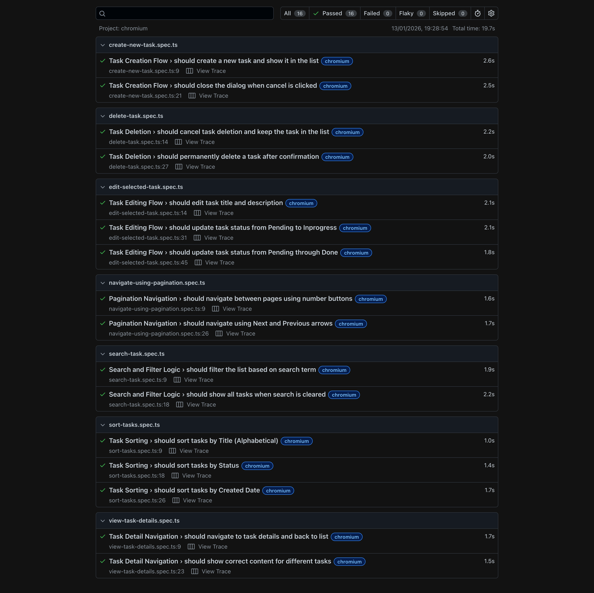

# 📝 Task Management Application

A simple but performance focused Task Management application built with Angular 21, Tailwind CSS, and a robust testing suites (jest and playwright)

This project was generated using [Angular CLI](https://github.com/angular/angular-cli) version 21.0.5.

## 🚀 Key Features

- Full CRUD Operations: Create, Read, Update, and Delete tasks.
- State Persistence: Tasks manage using signals and saved to LocalStorage for persistence across sessions.
- Advanced Filtering: Quick search with RxJS debouncing and multi criteria sorting (Title, Date, Status).
- Pagination: Efficiently handles list displays for better UX.

## 🏗 Architecture & Design Decisions

1. **Folder Structure: Layered Standalone Architecture**
The project follows a Feature-based + Layered approach. Instead of traditional NgModules, it utilizes Standalone Components to reduce boilerplate and improve performance.

   - `/pages`: Smart/Container components that handle routing and business logic.
   - `/components`: Dumb/Presentational components that focus solely on UI and reusability.
   - `/services`: Centralized state management using Angular signals and RxJS Subject.

2. **State Management: Fine-Grained Reactivity with Signals**
Instead of traditional RxJS-based state management, this application leverages Angular Signals to manage the global and local state.

   - `signal()`: Used in the TaskService to hold the primary task list, ensuring a reactive "Single Source of Truth."
   - `computed()`: Utilized for derived state, such as filtering and sorting the task list or calculating pagination totals. This ensures that expensive operations only re-run when their specific dependencies change.
   - `effect()`: Employed to synchronize the Signal state with LocalStorage, ensuring data persistence is handled automatically whenever the task signal updates.

3. **Hybrid Reactive Approach**
While the UI state is managed by Signals, I chose RxJS specifically for the search functionality.

   - `Why?`: RxJS is superior for handling asynchronous event streams. Operators like debounceTime(300) and distinctUntilChanged() are far more elegant for rate-limiting user input than trying to replicate that logic with Signals alone.

   - `Integration`: The search observable is converted into a signal (or used to update a signal), demonstrating a sophisticated understanding of how to combine the strengths of both reactive patterns.

## 🧪 Testing Strategy

### Unit Testing (Jest)

**Coverage:** 100% logic coverage for Services and Component logic.

**Focus:** Verifying business rules, data transformations, and state transitions in isolation.

***Command:***

```bash 
npm run test:coverage
```

### End-to-End Testing (Playwright)

**Focus:** Testing the "User Journey" including CRUD, Navigation, and Search logic.

**Stability:** Utilized **data-tm** (Test Marker) attributes to decouple tests from the UI/CSS structure.

**Command:**

```bash
npx playwright test
npm run test:e2e
```

**Note:** I used Playwright UI Mode for visual debugging and time-traveling through test steps. And Playwright codegen to generate initial tests.

## Development server

To start a local development server, run:

```bash
ng serve
```

Once the server is running, open your browser and navigate to `http://localhost:4200/`. The application will automatically reload whenever you modify any of the source files.

## 📊 Quality Assurance Results

### Unit Test Coverage

I used Jest to validate the business logic, specifically focusing on the Signal-based state management and RxJS streams.


### E2E Test Results

The E2E suite covers critical user journeys: task creation, persistent storage, and search debouncing. I use playwright for e2e tests.




## 💡 Thought Process

When building this, I prioritized Maintainability and Scalability. By separating "Smart" and "Dumb" components, the UI remains flexible. By investing in data-tm attributes for E2E tests, I ensured that future UI changes (like changing a button's label) won't break the automated test suite, reducing long-term maintenance costs. I chose Angular Signals because they offer better performance through fine-grained reactivity. Unlike Observables, Signals don't require the 'Zone.js' overhead to detect changes across the entire tree. they notify the specific component that needs to update. However, I kept RxJS for the search bar because Signals are not intended to replace 'streams' of events. By using RxJS for the timing logic (debouncing) and Signals for the data storage, I’ve built a 'best-of-both-worlds' architecture that is both highly performant and easy to maintain.
